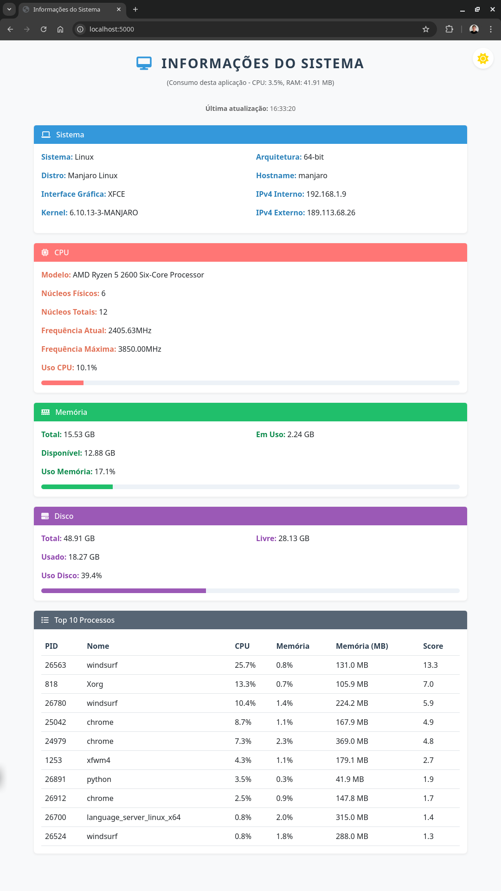
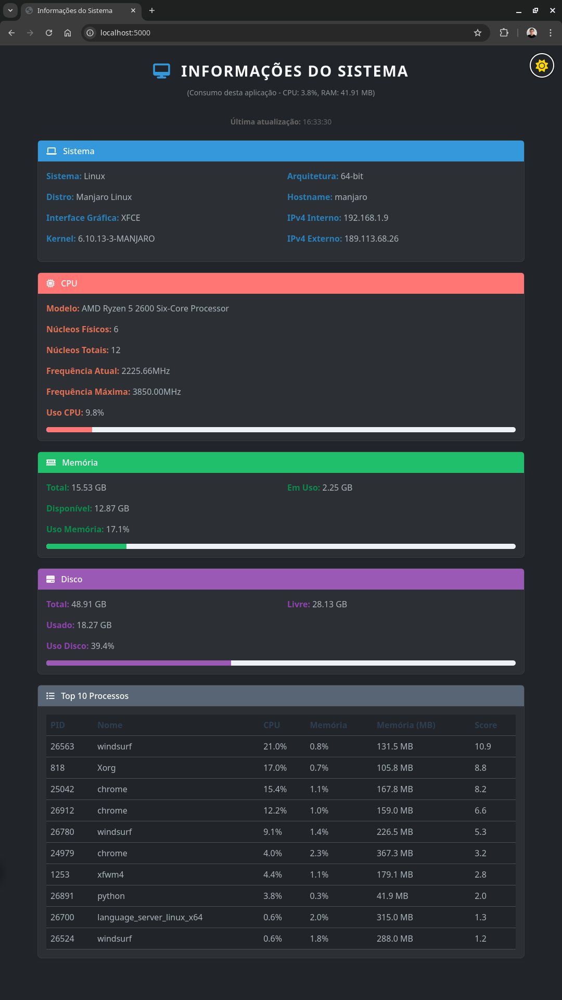

# Monitor de Sistema Web


Uma aplicação web em Python que mostra informações detalhadas do sistema, incluindo:
- Informações do Sistema Operacional
- Detalhes do Processador
- Uso de Memória
- Uso de Disco
- Temperaturas do Sistema (quando disponível)
- Lista de Pacotes Python Instalados

## Requisitos

- Python 3.6+
- pip (gerenciador de pacotes Python)

## Instalação

1. Clone este repositório ou baixe os arquivos

2. Instale as dependências:
```bash
pip install -r requirements.txt
```

## Uso

1. Execute o servidor Flask:
```bash
python app.py
```

2. Abra seu navegador e acesse:
```
http://localhost:5000
```

A página será atualizada automaticamente a cada 30 segundos para mostrar as informações mais recentes do sistema.

## Recursos

- Interface web moderna e responsiva usando Bootstrap
- Atualização automática das informações
- Visualização em tempo real do uso de CPU, memória e disco
- Suporte a múltiplos sistemas operacionais
- Design intuitivo com ícones e barras de progresso

## Screenshots

### Modo Light


### Modo Dark


## Notas

- Algumas informações podem não estar disponíveis em todos os sistemas operacionais
- As temperaturas do sistema só são mostradas quando os sensores estão disponíveis e acessíveis
- Em sistemas Linux, pode ser necessário executar com privilégios de superusuário para acessar algumas informações de temperatura
